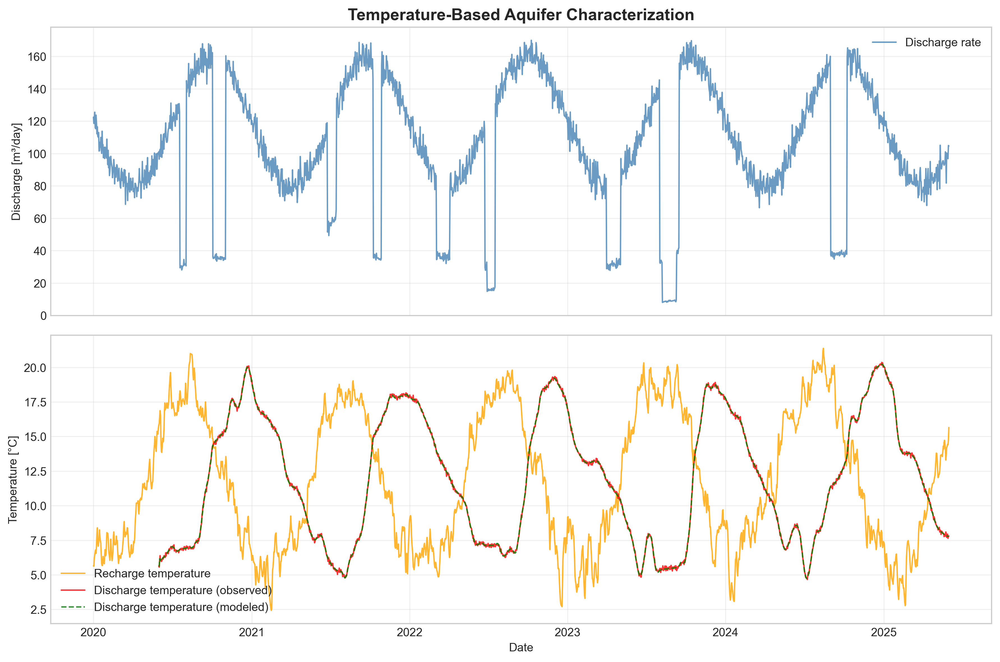

|                        |                                                                                                                                                                                                                                                                                                                                                                                                                                                                                                                                                                                                                                                                                                                                                              |
| ---------------------- | ------------------------------------------------------------------------------------------------------------------------------------------------------------------------------------------------------------------------------------------------------------------------------------------------------------------------------------------------------------------------------------------------------------------------------------------------------------------------------------------------------------------------------------------------------------------------------------------------------------------------------------------------------------------------------------------------------------------------------------------------------------ |
| Testing of source code | [](https://github.com/gwtransport/gwtransport/actions/workflows/functional_testing.yml) [](https://gwtransport.github.io/gwtransport/htmlcov/) [](https://github.com/gwtransport/gwtransport/actions/workflows/linting.yml) [](https://github.com/gwtransport/gwtransport/actions/workflows/release.yml) |
| Testing of examples    | [](https://github.com/gwtransport/gwtransport/actions/workflows/examples_testing.yml) [](https://gwtransport.github.io/gwtransport/htmlcov_examples/)                                                                                                                                                                                                                                                                                                                                                                           |
| Package                | [](https://pypi.org/project/gwtransport/) [](https://pypi.org/project/gwtransport/) [](https://github.com/gwtransport/gwtransport/compare/)                                                                                                                                                                                                                                    |
|                        |                                                                                                                                                                                                                                                                                                                                                                                                                                                                                                                                                                                                                                                                                                                                                              |

## Overview

`gwtransport` is a Python package for modeling groundwater transport processes, focusing on temperature and contaminant transport in heterogeneous aquifer systems. It provides tools for advection modeling, residence time analysis, and contaminant fate assessment.

### Key Concepts

**Aquifer Pore Volume Distribution**: Aquifers are heterogeneous - some flow paths hold more water than others. This package models this heterogeneity using a statistical distribution (typically gamma) that describes how aquifer pore volumes vary across different flow paths.

**Physical Basis**: When water enters an aquifer, it follows different paths with varying volumes and travel times. By analyzing temperature or tracer breakthrough curves, we can characterize this heterogeneity and predict contaminant transport.

### Workflow

1. **Characterization** ([Example 1](#example-1-aquifer-characterization)): Use temperature data to estimate aquifer heterogeneity parameters
2. **Analysis** ([Example 2](#example-2-residence-time-analysis)): Calculate residence time distributions for different flow paths
3. **Application** ([Example 3](#example-3-pathogen-removal-assessment)): Assess contaminant removal or transport predictions

### Key Assumptions

- Advection-dominated transport (Péclet number >> 1)
- Stationary aquifer pore volume distribution over time
- Well-mixed recharge conditions

## Installation

```bash
pip install gwtransport
```

## Usage Examples

### Example 1: Aquifer Characterization

Estimate aquifer heterogeneity parameters from temperature breakthrough data using inverse modeling:

```python
import pandas as pd
import numpy as np
from scipy.optimize import curve_fit
from gwtransport import advection, compute_time_edges

# Load temperature and flow time series data
recharge_temp = np.array(...)    # Temperature of infiltrating water [°C]
discharge_temp = np.array(...)   # Temperature of extracted water [°C]
flow_rates = np.array(...)       # Discharge rates [m³/day]

# Load time edges (1 item larger than data arrays, can be created using compute_time_edges function)
recharge_time_edges = np.array(...)  # Time edges for recharge temperature data
discharge_time_edges = np.array(...) # Time edges for discharge temperature data
flow_time_edges = np.array(...)      # Time edges for flow rate data

# Forward model for optimization
def temperature_model(xdata, mean_aquifer_pore_vol, std_aquifer_pore_vol):
    """Calculate modeled discharge temperature for given aquifer parameters."""
    modeled_temp = advection.gamma_forward(
        cin=recharge_temp,
        cin_tedges=recharge_time_edges,
        cout_tedges=discharge_time_edges,
        flow=flow_rates,
        flow_tedges=flow_time_edges,
        mean=mean_aquifer_pore_vol,           # Mean aquifer pore volume [m³]
        std=std_aquifer_pore_vol,             # Standard deviation [m³]
        n_bins=200,                   # Discretization resolution
        retardation_factor=2.0,       # Thermal retardation factor
    )
    return modeled_temp

# Nonlinear least squares optimization
(fitted_mean, fitted_std), covariance = curve_fit(
    temperature_model,
    discharge_time_edges,  # Use time centers from edges
    discharge_temp,
    p0=(8000.0, 400.0),              # Initial parameter estimates [m³]
    bounds=([1000, 50], [20000, 2000])  # Physical constraints [m³]
)

# Report results with uncertainty
print("Aquifer characterization results:")
print(f"Mean aquifer pore volume: {fitted_mean:.0f} ± {np.sqrt(covariance[0,0]):.0f} m³")
print(f"Standard deviation: {fitted_std:.0f} ± {np.sqrt(covariance[1,1]):.0f} m³")
print(f"Coefficient of variation: {fitted_std/fitted_mean:.2f}")
```



### Example 2: Residence Time Analysis

Calculate residence time distributions for different flow paths using characterized aquifer parameters:

```python
import pandas as pd
import numpy as np
import matplotlib.pyplot as plt
from gwtransport import gamma, compute_time_edges
from gwtransport.residence_time import residence_time

# Use parameters from aquifer characterization (Example 1)
mean_aquifer_pore_volume = 8000.0   # Mean aquifer pore volume [m³]
std_aquifer_pore_volume = 400.0     # Standard deviation [m³]
flow_data = np.array(...)  # Discharge time series [m³/day]

# Load time edges (1 item larger than flow_data, can be created using compute_time_edges function)
flow_tedges = np.array(...)  # Time edges for flow data

# Discretize aquifer pore volume distribution into flow paths
aquifer_pore_vol_bins = gamma.bins(mean=mean_aquifer_pore_volume, std=std_aquifer_pore_volume, n_bins=1000)

# Calculate residence times for different scenarios
# Water residence time (conservative tracer)
rt_water = residence_time(
    flow=flow_data,
    flow_tedges=flow_tedges,
    aquifer_pore_volume=aquifer_pore_vol_bins["expected_value"],
    retardation_factor=1.0,           # No retardation for water/conservative tracers
    direction="infiltration"          # Forward: when will water be extracted?
)

# Contaminant residence time (with retardation)
rt_contaminant = residence_time(
    flow=flow_data,
    flow_tedges=flow_tedges,
    aquifer_pore_volume=aquifer_pore_vol_bins["expected_value"],
    retardation_factor=3.0,           # Sorbing contaminant (slower transport)
    direction="infiltration"
)

# Statistical analysis of residence time distributions
mean_rt_water = np.nanmean(rt_water, axis=0)        # Mean across all flow paths
p10_rt_water = np.nanpercentile(rt_water, 10, axis=0)  # Fast flow paths
p90_rt_water = np.nanpercentile(rt_water, 90, axis=0)  # Slow flow paths

print(f"Water residence time range: {np.nanmin(mean_rt_water):.1f} - {np.nanmax(mean_rt_water):.1f} days")
print(f"Mean residence time: {np.nanmean(mean_rt_water):.1f} days")
```


### Example 3: Pathogen Removal Assessment

Evaluate pathogen log-removal efficiency based on residence time distributions:

```python
import numpy as np
from gwtransport import logremoval, gamma

# Pathogen parameters (example: virus removal)
log_removal_rate = 0.8    # First-order removal rate [1/day]
                         # (typical range: 0.5-2.0 for viruses)

# Convert residence time statistics to removal efficiency
# Using residence times from Example 2
mean_rt = np.nanmean(mean_rt_water)
std_rt = np.nanstd(mean_rt_water)

# Fit gamma distribution to residence time statistics
rt_alpha, rt_beta = gamma.mean_std_to_alpha_beta(mean_rt, std_rt)

# Calculate log-removal statistics
mean_log_removal = logremoval.gamma_mean(rt_alpha, rt_beta, log_removal_rate)
log_removal_distribution = logremoval.gamma_distribution(
    rt_alpha, rt_beta, log_removal_rate, n_points=1000
)

# Risk assessment metrics
p10_removal = np.percentile(log_removal_distribution['log_removal'], 10)  # Conservative estimate
p50_removal = np.percentile(log_removal_distribution['log_removal'], 50)  # Median removal
p90_removal = np.percentile(log_removal_distribution['log_removal'], 90)  # Optimistic estimate

print("Pathogen removal assessment:")
print(f"Mean log-removal: {mean_log_removal:.2f}")
print(f"Conservative estimate (10th percentile): {p10_removal:.2f}")
print(f"Median estimate: {p50_removal:.2f}")
print(f"Optimistic estimate (90th percentile): {p90_removal:.2f}")

# Risk evaluation
if p10_removal >= 4.0:  # WHO guideline for virus removal
    print("✓ Meets WHO 4-log virus removal guideline")
else:
    print(f"⚠ Below WHO guideline (need {4.0 - p10_removal:.1f} additional log removal)")
```

## Complete Examples

For detailed, runnable examples with data generation and visualization:

- **[Aquifer Characterization](https://github.com/gwtransport/gwtransport/blob/main/examples/01_Estimate_aquifer_pore_volume_from_temperature_response.py)**: Complete inverse modeling workflow using temperature breakthrough data
- **[Residence Time Analysis](https://github.com/gwtransport/gwtransport/blob/main/examples/02_Estimate_the_residence_time_distribution.py)**: Comprehensive residence time distribution calculations and visualization
- **[Pathogen Risk Assessment](https://github.com/gwtransport/gwtransport/blob/main/examples/03_Log_removal.py)**: Risk-based evaluation of pathogen removal in groundwater systems

## Contributing

Contributions are welcome! Please feel free to submit a Pull Request.

## Credits and License

This project is initially created by Bas des Tombe and is maintained and extended by many contributors. It is licensed under the GNU Affero General Public License v3.0 - see the LICENSE file for details.
